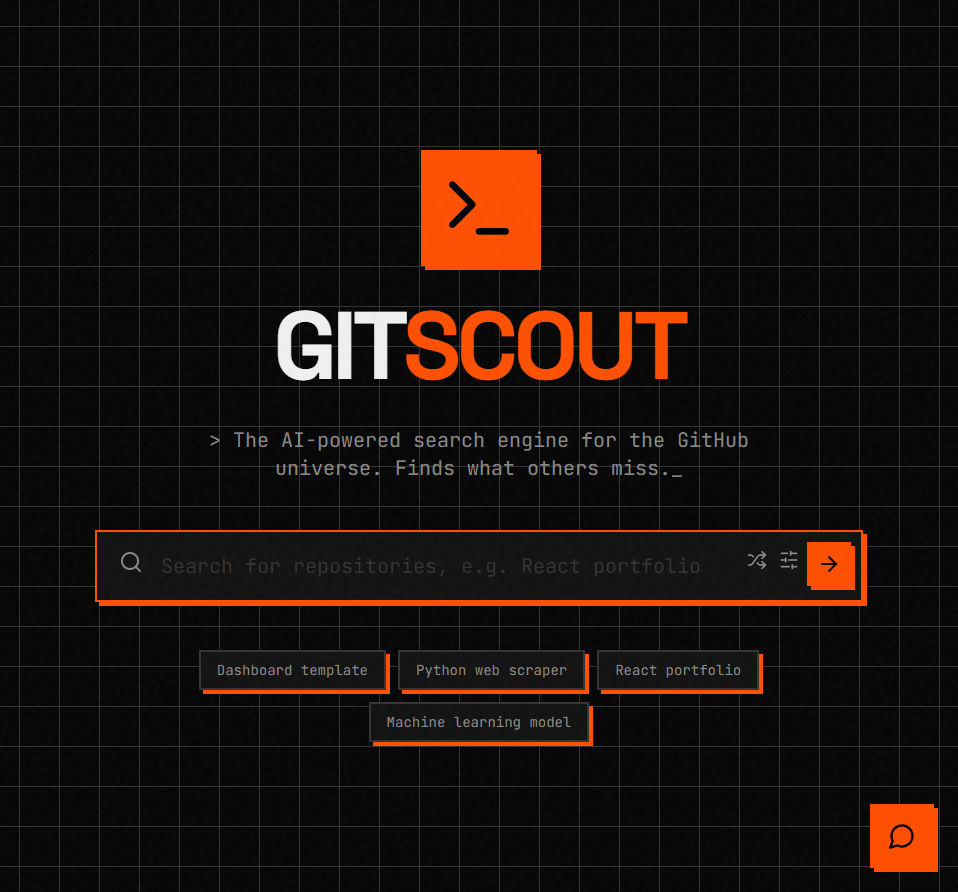

# GitScout 2.0

**The AI-powered search engine for the GitHub universe — finds what others miss.**

[](LICENSE)
[](https://react.dev)
[](https://vite.dev)
[](https://www.typescriptlang.org)
[](https://ai.google.dev)

GitScout turns plain-English requests into precise GitHub searches. You type *"a React portfolio
template"*; it rewrites that into GitHub's strict query syntax behind the scenes, ranks the results,
and lets you **chat with any repository** to decide if it's worth your time — without leaving the page.



---

## Why it's different from GitHub search

GitHub's own search is literal: it matches keywords against a strict query grammar most people never
learn. GitScout puts a language model in front of it.

| | GitHub search | **GitScout 2.0** |
|---|---|---|
| Query | You write `language:python stars:>500 web scraper` | You write *"a popular python web scraper"* |
| Synonyms | Exact terms only | Expands (`react` → `(react OR reactjs)`) |
| Vetting a repo | Open it, read the README, skim issues | **Ask the AI** about it inline |
| Filtering | Manual syntax | Visual filters **and** natural language, merged |

## Features

- **Natural-language → GitHub query.** A Gemini-backed optimizer rewrites your request into valid
  GitHub Search API syntax (synonym expansion, qualifiers, sane defaults). Already know the syntax?
  Type it raw and GitScout leaves it untouched.
- **Chat with a repo.** Open any result and ask the AI assistant questions about it — what it does,
  how to get started, whether it fits your use case. Conversations persist locally per repo.
- **AI quality signal.** Repositories get an at-a-glance AI rating so you can triage fast.
- **Visual filters that compose with text.** Language, minimum stars, owner/org, OS hint, and sort
  order — layered on top of whatever you typed.
- **"Surprise me."** A shuffle button seeds the search with a fresh idea when you're just browsing.
- **Built to feel fast.** Smooth Motion transitions and race-condition-safe search (stale responses
  are discarded), so rapid typing never shows the wrong results.

## Tech stack

React 19 · Vite 6 · TypeScript · [`@google/genai`](https://www.npmjs.com/package/@google/genai)
(Gemini 2.5 Flash) · `lucide-react` · `react-markdown` · `motion`.

The GitHub layer calls the public Search API directly — no backend, no server to run. Everything is a
static single-page app.

---

## Getting started

> **Prerequisites:** [Node.js](https://nodejs.org) 18+ and a free
> [Google Gemini API key](https://aistudio.google.com/app/apikey) (for the AI features).

```bash
git clone https://github.com/za3ter123/gitscout-2.0.git
cd gitscout-2.0
npm install
```

Create a `.env.local` file in the project root with your key:

```env
GEMINI_API_KEY=your_api_key_here
```

Then start the dev server:

```bash
npm run dev          # http://localhost:3000
```

Other scripts:

```bash
npm run build        # production build → dist/
npm run preview      # preview the production build locally
```

### About the AI key

The Gemini key powers the query optimizer and the per-repo chat. **Plain GitHub search works without
it** — GitScout falls back to passing your query through verbatim — so you can run the app keyless and
still search; you just won't get the natural-language rewriting or the AI assistant. The key lives only
in your local `.env.local` and is never committed.

## How it works

```
        your words                Gemini 2.5 Flash              GitHub Search API
   "popular rust CLI tool"  ──▶  language → query syntax  ──▶  language:rust stars:>… ──▶  ranked results
                                                                                                │
                                              ask the AI about any result  ◀────────────────────┘
```

1. `services/geminiService.ts` — turns natural language into a GitHub query and powers the repo chat
   and rating.
2. `services/githubService.ts` — merges the optimized query with your visual filters and calls the
   GitHub Search API, with pagination.
3. `App.tsx` + `components/` — the search UI, filter bar, result cards, and the slide-in AI chat panel.

## Project structure

```
gitscout-2.0/
├── App.tsx                 # top-level state + search flow
├── components/
│   ├── RepoCard.tsx        # a single result
│   ├── FilterBar.tsx       # language / stars / owner / OS / sort
│   ├── AIChat.tsx          # chat thread (localStorage-persisted)
│   └── ChatAssistant.tsx   # chat panel shell
├── services/
│   ├── geminiService.ts    # query optimizer + repo chat/rating (Gemini)
│   └── githubService.ts    # GitHub Search API client
├── types.ts                # shared types
└── vite.config.ts
```

## License

[MIT](LICENSE) © 2026 za3ter123
